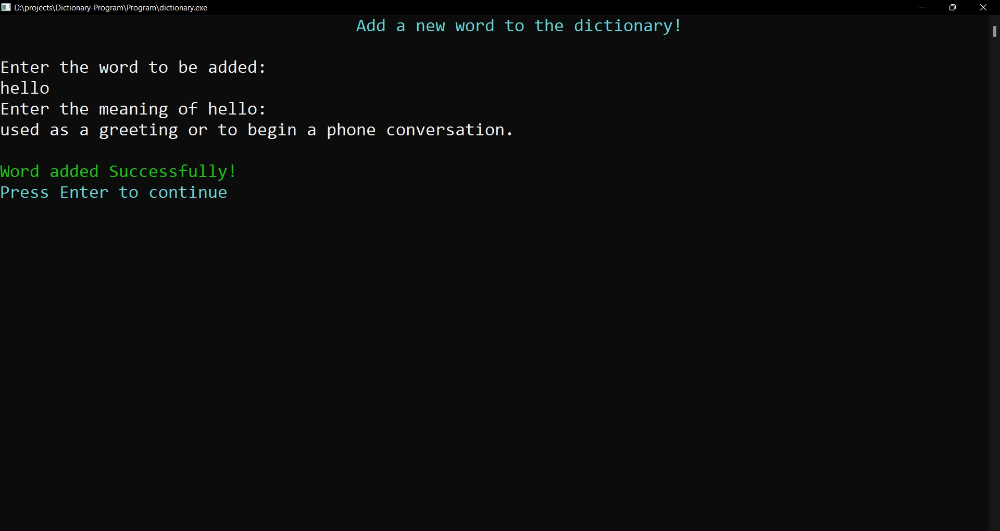

# Dictionary  Program

A Dictionary implemented with Trie data structure using C++

## Installation

In order to run this program, you must be on a Windows system. You must also have a C++ compiler (Like the MSYS2 compiler) installed. You can find the steps to install MSYS2 [here](https://www.msys2.org/)

 

## Screenshots

Here we can see a few screenshots of the working of the dictionary program. We can see the program searching for a word, adding a word along with its meaning and also deleting a word.

Loading Screen

  
   This is the loading screen of the program. (Note: The program doesn't really need loading time but implementing this seemed an interesting idea)

Main Menu

  
   This is the home screen or main menu of the program. From here we can select any of the listed options.

Word Search

  
  
   Here we have searched for the word 'the'. The search was successful and the program has also shown the suggested words after searching.

Delete Word

  
  
   Here, we have tried to delete the word 'hello'. However, as this word did not exist in the database, the deletion procedure fails.
  

Add Word

  
  
   Here, we successfully add the word hello along with its meaning to our database. We can check if the word has been added properly by searching for it again as follows:
  
  
   As we can see, the search for 'hello' now works.
  

 

## Running the program

1. Go into 'Program' folder and run the dictionary.exe file
